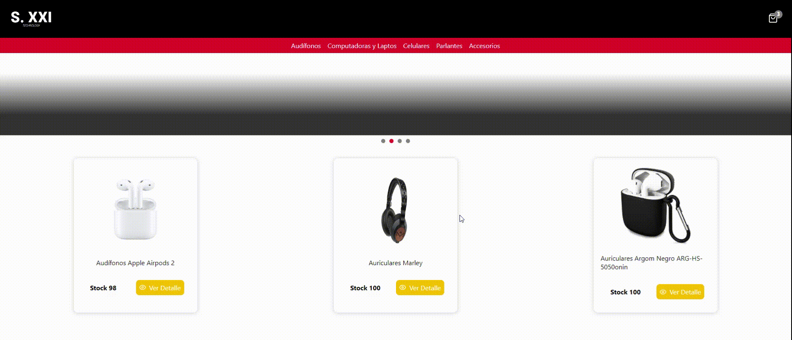
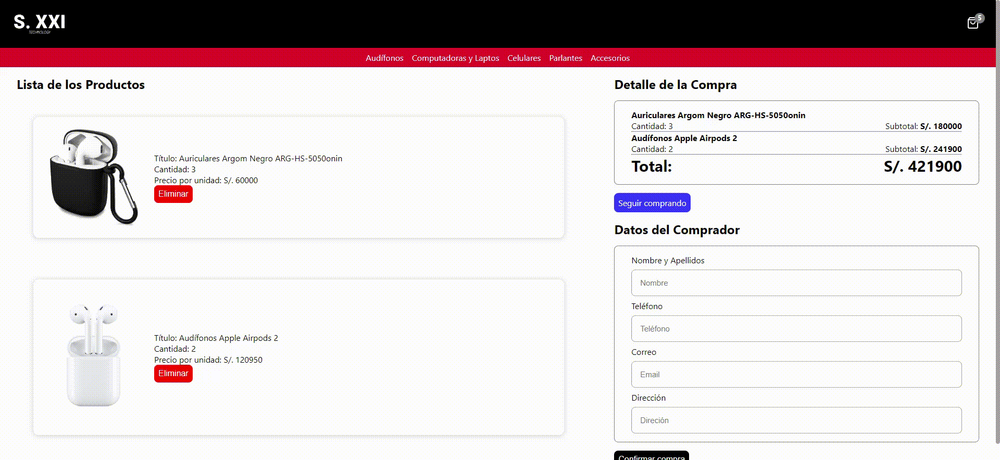

## ÍNDICE
* [1. S.XXI Technology](#1-S-XXI-Technology)
  - [1.1 Descripción del Proyecto](##1.1-Descripción-del-Proyecto)
  - [1.2 Interacción con la página](##1.2-Interacción-con-la-página)
* [2. Tecnologías empleadas](#3-Tecnologias-Empleadas)
* [3. Fuentes](#4-Fuentes)
* [4. Autores](#5-Autores)

***

# 1. S.XXI Technology 

## 1.1  Descripción del Proyecto

👩🏽‍💻 **S.XXI Technology**  es un proyecto realizado en 1 mes con asesoramiento por parte de coderhouse. Trata sobre un ecommerce cuya temática es la venta de productos tecnológicos como (laptops, celulares, parlantes, audifonos, etc.)

## 1.2  Interación con la página
Se puede acceder a la página mediante el siguiente [link](sxxi-tecnology.netlify.app/), y además se adjunta la videodemostración para el funcionamiento de cada flujo, con el fin de brindar entendimento e interactuar con todas las vistas y funcionalidades de la interfaz.

## 📌 Página de Inicio

## 📌 Ver Detalle del Producto | Agregar Producto

## 📌 Lista de Compra | Eliminar Producto

***

## 4. Tecnologías empleadas 👩🏾‍💻

## 4.1 Para la estructura y diseño:

-   [React.js:](https://es.reactjs.org/) Librería implementada para crear una interfaz de usuario interactiva de manera sencilla.

-   [Javascript:](https://developer.mozilla.org/es/docs/Web/JavaScript)  Para dar la funcionalidad a la plataforma.

-   [Firebase:](https://firebase.google.com) Se trata de una plataforma móvil creada por Google, cuya principal función es desarrollar y facilitar la creación de apps de elevada calidad de una forma rápida. Para este proyecto se uso lo siguiente:

- [Netlify:](http://netlify.com) Es un servicio de hosting
para sitios web estáticos.
Para usarlo primero necesitas crear una cuenta en
Netlify y después puedes [conectar](https://www.netlify.com/blog/2016/07/22/deploy-react-apps-in-less-than-30-seconds/) tu repositorio.

***
## 3. Fuentes 📚
- [CoderHouse:]() Asesoramiento por parte del equipo de CoderHouse. Se brindó todas las condiciones y herramientas a trabajar para el proyecto.
- [Coolbox:](https://www.coolbox.pe/) Inspiración para la temática y obtención de recursos multimedia.

***

## 4. Autores 📍
- [Rosamaria Rodriguez](https://github.com/RJRCH123)
- Equipo de CoderHouse NOVIEMBRE 2022

****

